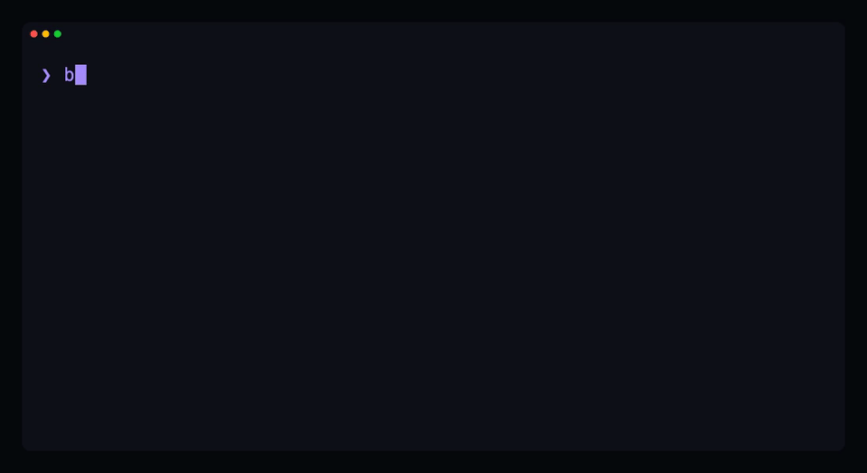

# Block Runner

**The primitive between everything and WordPress blocks.**

[](https://www.npmjs.com/package/block-runner)
[](https://www.npmjs.com/package/block-runner)
[](https://github.com/humanmade/block-runner/actions/workflows/ci.yml)
[](./LICENSE)



Block Runner is the layer between **generated content and WordPress**. AI tools, agents, and
design tools spit out HTML, but the block editor only trusts blocks it recognizes, so it
freezes everything else into a single "Custom HTML" blob, or breaks the block outright with
"Attempt Block Recovery." Block Runner converts that output into real, nested, **native**
Gutenberg blocks (`wp:cover > wp:columns > wp:buttons`) and proves every result is
editor-valid. Built to sit in an agent loop, a content pipeline, or a CI gate.

| | Generated HTML reaches the editor as… |
| --- | --- |
| **Today** ❌ | one frozen `Custom HTML` blob, or a broken block and *"Attempt Block Recovery"* |
| **With Block Runner** ✅ | `wp:cover > wp:columns > wp:buttons`: real, nested, editable, valid |

## Quickstart

```sh
npm install block-runner          # requires Node 18.12+
```

Then just ask your coding agent (Claude Code, Codex):

> Use block-runner to convert this hero into a native Gutenberg block.

Or run the CLI yourself:

```sh
# native blocks stream to stdout by default; pipe them anywhere
block-runner convert hero.html

# pipe in from an agent, a generator, or curl
generate-page | block-runner convert -

# or write straight to a file
block-runner convert hero.html --out hero.blocks.html
```

Every run is checked against headless Gutenberg, so what comes back is guaranteed
editor-valid, or Block Runner tells you exactly what wasn't and points at the line.

## What it does

Two jobs: **convert** generated HTML into native blocks, and **validate** that what you ship
is editor-valid. Use either half on its own: convert in your agent pipeline, or run the gate
as a standalone validator in CI.

### Convert: generated HTML → native blocks

- **Native blocks, not blobs.** Real `wp:cover > wp:columns > wp:buttons`, properly nested, with real media ids.
- **Built for agents and pipelines.** Feed it whatever your LLM, agent, or design tool emits; get back blocks the editor trusts.
- **Media resolution.** Resolve images to real attachment ids via a map, WP-CLI, or the REST API.
- **Styling fidelity, your call.** Keep off-theme styles or map them to your theme, up to a ceiling you set.
- **Pluggable engines.** Deterministic rules out of the box; bring your own rules, or plug an LLM/agent engine into the same seam.

### Validate: prove it's editor-valid

- **Valid means what the editor means.** Every result runs through a gate wired to headless Gutenberg, not a converter's wishful thinking.
- **Deterministic gate.** Reproducible: same markup, same verdict, no nondeterministic model in the loop. Safe to run on every request and in CI.
- **Canonicalize.** Rewrite near-miss markup into the exact shape the editor expects.
- **Never fails silently.** When something can't be expressed natively, it says so and points at the exact line.

## Why Block Runner

Content now pours out of AI and agents faster than anyone can hand-build it, but the
WordPress editor only trusts blocks it recognizes. The moment that generated HTML reaches it,
your cover, columns, and buttons collapse into a single frozen "Custom HTML" blob. Beautiful
design in, spaghetti out.

Block Runner is the missing layer between the two: it turns whatever your agents and tools
generate into the real thing (properly nested blocks, real media, exactly how you'd have
built it by hand), then proves it's valid against headless Gutenberg before it reaches the
editor. The connective tissue between how content is made now and how WordPress renders it.

**Any content in. Real blocks out.**

## CLI

Three commands: `convert` (HTML to blocks), `validate` (check block markup), and `fix`
(canonicalize block markup).

```sh
block-runner convert hero.html                    # blocks to stdout
block-runner validate "content/**/*.html" --json
block-runner fix post-content.html --out post-content.fixed.html
```

Read from stdin with `-`:

```sh
cat hero.html | block-runner convert -
```

### Flags

All commands:

| Flag | Description |
| --- | --- |
| `--config <path>` | Use a specific config file (otherwise auto-loaded from the working directory). |
| `--json` | Emit a machine-readable JSON report instead of text or markup. |
| `--strict` | Exit `1` on strict warnings (unresolved media, fallback blocks). |
| `--explain` | Include rule attribution and near-misses in the report. |

`convert` and `fix` also take `--out <path>` to write the result to a file instead of stdout.

`convert` adds media-resolution flags:

| Flag | Description |
| --- | --- |
| `--resolver <kind>` | Media resolver: `noop`, `map`, `wpcli`, `rest`. |
| `--wp-url <url>` | WordPress URL for `wpcli` or `rest` resolution. |
| `--wp-user <user>` | WordPress username for `rest` resolution. |
| `--wp-app-password-env <name>` | Env var holding a WordPress application password. |

### Exit codes

- `0`: clean
- `1`: problems found
- `2`: usage or I/O error
- `3`: headless Gutenberg boot failure

## Library

```ts
import { canonicalize, convert, validate } from 'block-runner';

const validation = await validate(markup);
const fixed = await canonicalize(markup);
const converted = await convert(html, { resolver: 'noop' });
```

## Conversion

Conversion runs on a pluggable engine. v1 ships a deterministic rule engine: an ordered
walker that maps HTML straight to real block objects with `createBlock()` and serializes
them with `serialize()`, skipping the brittle WordPress paste pipeline entirely. Fast, free,
reproducible, and it already nails the composites the editor usually mangles:

- Cover sections with inline or CSS background images
- Columns and column-like rows
- Buttons and button groups
- Images, headings, paragraphs, and lists
- Generic groups, with a last-resort Custom HTML fallback that always warns

The rules are a seam, not a ceiling. When a layout outgrows them, drop in your own rules, or
an LLM or agent engine, on the same interface (experimental). Deterministic rules for the
common case, a model for the long tail, one contract for both. Whichever engine emits a
block, every result is held to the same validity gate before it ships.

## Media Resolution

Cover and Image blocks can be resolved with:

- `noop`: keep URLs and warn when IDs are missing
- `map`: read IDs and URLs from a JSON map
- `wpcli`: use `wp media list` and `wp media import`
- `rest`: use the WordPress REST media API when credentials are explicitly
  supplied

Remote sideloading is off by default. Under `--strict`, unresolved media and
fallback blocks cause exit code `1`.

## Configuration

Block Runner auto-loads `block-runner.config.{mjs,js,json}` from the working
directory, so most runs need no flags; the config sets the media resolver, tokens,
and rules. Pass `--config <path>` only to point at a config elsewhere.

`block-runner.config.mjs`:

```js
export default {
  strict: false,
  media: {
    resolver: 'map',
    mapFile: './media-map.json',
  },
  tokens: {
    colors: {
      dark: 'contrast',
      light: 'base',
      accent: 'accent',
    },
    fonts: {
      heading: 'display',
      body: 'body',
    },
    spacing: ['20', '30', '40', '50', '60'],
  },
};
```

## Styling fidelity

Design HTML often carries custom CSS (and sometimes JavaScript) that doesn't match
the target theme. The `styling` level controls how much of it Block Runner keeps. The
levels run from safest (cleanest, most editable blocks) to most faithful (keeps the
original look, but less editable):

| Level | What it does |
|---|---|
| `strict` | Map to the theme only. Off-theme styles are dropped. Cleanest, fully on-brand, fully editable. |
| `relaxed` | Keep exact off-theme values on the block (custom color, size, spacing). Still native and fully editable. |
| `open` | Also keep CSS no block can express, by wrapping the element and shipping that CSS alongside. Look preserved, structure still editable. |
| `source` | Keep the original markup as a Custom HTML block. Exact, but not editable. Last resort. |

You set one ceiling. Per block, Block Runner uses the **strictest level that still
captures the design**, and never goes past your ceiling. It's configured in
`block-runner.config.mjs`:

```js
export default { styling: 'relaxed' }; // default (a per-run --styling flag is planned)
```

Custom JavaScript is never inlined. A behavior maps to a native interactive block,
comes from a block plugin, or is dropped, and every drop or escalation is reported.

> Status: `relaxed` and `open` are in progress. Today the converter behaves like
> `strict` (off-theme styling is dropped) with a `source` (Custom HTML) fallback.

## Benchmark

A conversion benchmark lives under `benchmarks/`: it measures how faithfully real generator
output (Impeccable, Codex, Claude, and more) converts to native blocks, across swappable
conversion engines (the deterministic rules; experimental LLM translators run via their CLIs,
no API key).

```sh
npm run bench          # score the suite; write report/review.html + report/scoreboard.html
npm run bench:record   # also append a provenance-tagged run to benchmarks/results.jsonl
```

Runs are recorded with `engine` / `model` / `effort` / `suiteHash`, so older engines stay
backtestable against the current suite (`scripts/backtest.sh`). See `benchmarks/README.md`
for adding producers and engines.

## License

GPL-2.0-or-later.
